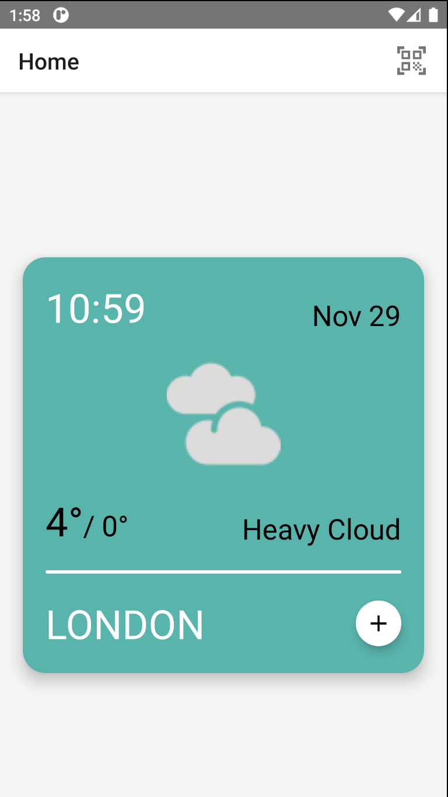

# My Weather

This project shows the forecast of a city searched via TextInput or of your current city via the current gps position of the device. The ReactNative app works with https://www.metaweather.com api. No `apikey` is required.

## Available Scripts

If you want to try this app, you have to download or clone this project. Once this is done, you have to run the following commands:

```bash
npm install
npm run start
npm run android
```

## Considerations

The app flow has only been tested with Android device, which means that iOS may not work properly.

## Some Screenshots

Home page, the first screen that you can see when the app is launched


The screen that helps you to search a place


The place forecast detail

